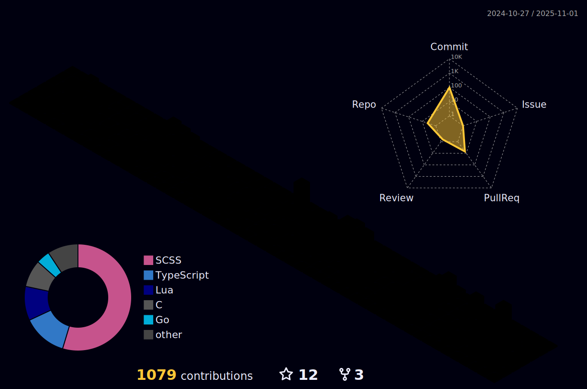

<link rel="stylesheet" type='text/css' href="https://cdn.jsdelivr.net/gh/devicons/devicon@latest/devicon.min.css" />

### Hello, I'm Pedro Santana

I am currently majoring in computer science at IFG Anápolis! I have experience in developing in frontend and backend. I'm passionate about writing clean, maintainable code and design with users in mind, thriving in environments that love innovation and continuous professional growth.

## Connect with me:

  

<!-- 

------
<h3 align="left">Activity:</h3>

  

  

-->

------
<h3 align="left">Languages and Tools:</h3>
<table>
    <tr>
        <td style="font-weight: bold; padding-right: 10px; vertical-align: center; border: none;">Backend:</td>
        <td></td>
    </tr>
    <tr>
        <td style="font-weight: bold; padding-right: 10px; vertical-align: center;">Frontend:</td>
        <td></td>
    </tr>
    <tr>
        <td style="font-weight: bold; padding-right: 10px; vertical-align: center; border: none;">Database:</td>
        <td></td>
    </tr>
    <tr>
        <td style="font-weight: bold; padding-right: 10px; vertical-align: center; border: none;">DevOps:</td>
        <td></td>
    </tr>
    <tr>
        <td style="font-weight: bold; padding-right: 10px; vertical-align: center; border: none;">Version Control:</td>
        <td></td>
    </tr>

